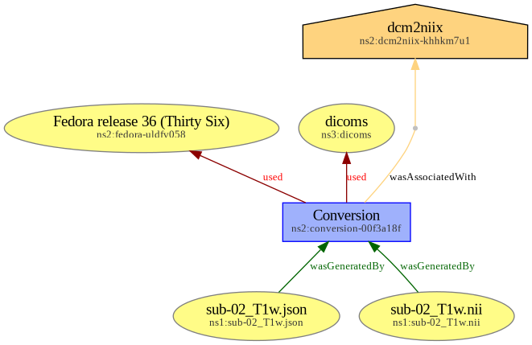

# Provenance of DICOM to Nifti conversion with `dcm2niix`

## Goal

This example aims at showing provenance metadata for a DICOM to Nifti conversion with [`dcm2niix`](https://github.com/rordenlab/dcm2niix
). Provenance metadata was created manually ; its acts as a guideline for further machine-generated provenance by `dcm2niix`. 

## Source data

That the `sourcedata/` directory contains the source dataset (DICOM files) known as [hirni-demo](https://github.com/psychoinformatics-de/hirni-demo).

## Directory tree

After conversion, and adding provenance traces, the directory tree is as follows.

Legend:
* files with a ⭐ were generated by `dcm2niix`;
* files marked with a ✍️ were generated manually;
* files marked with a 🤖 were computed from the manually generated provenance metadata;
* the ⭐✍️ marked `sub-02/anat/sub-02_T1w.json` file was generated by `dcm2niix`, then the `GeneratedBy` and `SidecarGeneratedBy` provenance-related fields were added manually.

> [!NOTE]
> Note that the `docs/` directory contains explanatory data (see [Provenance as a RDF graph](#provenance-as-a-rdf-graph)) that is not required to encode provenance.

```
✍️ docs/
├── 🤖 prov-dcm2niix.jsonld
└── 🤖 prov-dcm2niix.png
✍️ prov/
├── ✍️ prov-dcm2niix_act.json
├── ✍️ prov-dcm2niix_ent.json
├── ✍️ prov-dcm2niix_env.json
└── ✍️ prov-dcm2niix_soft.json
sourcedata/
⭐ sub-02/
└── ⭐ anat
    ├── ⭐✍️ sub-02_T1w.json
    └── ⭐ sub-02_T1w.nii
```

## Provenance as a RDF graph

Provenance metadata can be aggregated as a JSON-LD RDF graph, which is available in [`docs/prov-dcm2niix.jsonld`](docs/prov-dcm2niix.jsonld). This is a rendered version of the graph, also available in [`docs/prov-dcm2niix.png`](docs/prov-dcm2niix.png).


