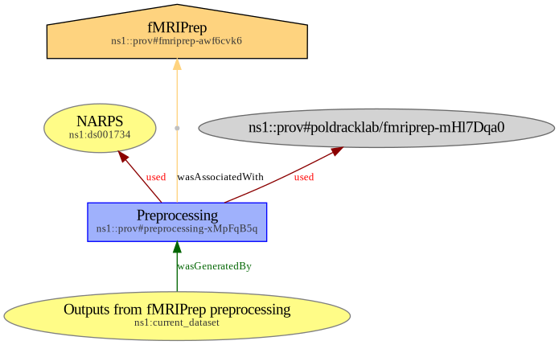

# BEP028 example dataset - Provenance metadata for `fMRIPrep`

## Goal

This example aims at showing provenance metadata for a preprocessing with [`fMRIPrep`](https://fmriprep.org/en/23.1.3/index.html). Provenance metadata was generated manually ; this acts as a guideline for minimal provenance description at dataset level.

## Original dataset

This dataset is a subset of the `fmriprep` derivative dataset from [ds001734](https://openneuro.org/datasets/ds001734/versions/1.0.5), which contains raw and preprocessed fMRI data of two versions of the mixed gambles task, from the Neuroimaging Analysis Replication and Prediction Study (NARPS). **Only data for subject `sub-001` is kept in this example.** All `.nii.gz` files were replaced by empty files.

## Directory tree

After preprocessing, and adding provenance traces, the directory tree is as follows.

Legend:
- ✳️ files that were generated manually;
- ✍️ files that were originally available in the ds001734 dataset, but edited for this example;
- ⭐ files that were originally available in the ds001734 dataset as is.

```
.
├── dataset_description.json
├── derivatives
│   └── fmriprep
│       └── sub-001
│           ├── anat
│           │   ├── sub-001_T1w_brainmask.nii.gz
│           │   ├── sub-001_T1w_dtissue.nii.gz
│           │   ├── sub-001_T1w_label-aparcaseg_roi.nii.gz
│           │   ├── sub-001_T1w_label-aseg_roi.nii.gz
│           │   ├── sub-001_T1w_preproc.nii.gz
│           │   ├── sub-001_T1w_space-MNI152NLin2009cAsym_brainmask.nii.gz
│           │   ├── sub-001_T1w_space-MNI152NLin2009cAsym_dtissue.nii.gz
│           │   └── sub-001_T1w_space-MNI152NLin2009cAsym_preproc.nii.gz
│           └── func
│               ├── sub-001_task-MGT_run-01_bold_confounds.tsv
│               ├── sub-001_task-MGT_run-01_bold_space-MNI152NLin2009cAsym_brainmask.nii.gz
│               ├── sub-001_task-MGT_run-01_bold_space-MNI152NLin2009cAsym_preproc.nii.gz
│               ├── sub-001_task-MGT_run-01_bold_space-T1w_label-aparcaseg_roi.nii.gz
│               ├── sub-001_task-MGT_run-01_bold_space-T1w_label-aseg_roi.nii.gz
│               ├── sub-001_task-MGT_run-02_bold_confounds.tsv
│               ├── sub-001_task-MGT_run-02_bold_space-MNI152NLin2009cAsym_brainmask.nii.gz
│               ├── sub-001_task-MGT_run-02_bold_space-MNI152NLin2009cAsym_preproc.nii.gz
│               ├── sub-001_task-MGT_run-02_bold_space-T1w_label-aparcaseg_roi.nii.gz
│               ├── sub-001_task-MGT_run-02_bold_space-T1w_label-aseg_roi.nii.gz
│               ├── sub-001_task-MGT_run-03_bold_confounds.tsv
│               ├── sub-001_task-MGT_run-03_bold_space-MNI152NLin2009cAsym_brainmask.nii.gz
│               ├── sub-001_task-MGT_run-03_bold_space-MNI152NLin2009cAsym_preproc.nii.gz
│               ├── sub-001_task-MGT_run-03_bold_space-T1w_label-aparcaseg_roi.nii.gz
│               ├── sub-001_task-MGT_run-03_bold_space-T1w_label-aseg_roi.nii.gz
│               ├── sub-001_task-MGT_run-04_bold_confounds.tsv
│               ├── sub-001_task-MGT_run-04_bold_space-MNI152NLin2009cAsym_brainmask.nii.gz
│               ├── sub-001_task-MGT_run-04_bold_space-MNI152NLin2009cAsym_preproc.nii.gz
│               ├── sub-001_task-MGT_run-04_bold_space-T1w_label-aparcaseg_roi.nii.gz
│               └── sub-001_task-MGT_run-04_bold_space-T1w_label-aseg_roi.nii.gz
├── docs
│   ├── prov-fmriprep.jsonld
│   └── prov-fmriprep.png
├── participants.tsv
├── prov
│   ├── ✳️ prov-fmriprep_act.json
│   ├── ✳️ prov-fmriprep_ent.json
│   ├── ✳️ prov-fmriprep_env.json
│   └── ✳️ prov-fmriprep_soft.json
├── README.md
├── sub-001
│   ├── anat
│   │   └── sub-001_T1w.nii.gz
│   └── func
│       ├── sub-001_task-MGT_run-01_bold.nii.gz
│       ├── sub-001_task-MGT_run-01_events.tsv
│       ├── sub-001_task-MGT_run-01_sbref.nii.gz
│       ├── sub-001_task-MGT_run-02_bold.nii.gz
│       ├── sub-001_task-MGT_run-02_events.tsv
│       ├── sub-001_task-MGT_run-02_sbref.nii.gz
│       ├── sub-001_task-MGT_run-03_bold.nii.gz
│       ├── sub-001_task-MGT_run-03_events.tsv
│       ├── sub-001_task-MGT_run-03_sbref.nii.gz
│       ├── sub-001_task-MGT_run-04_bold.nii.gz
│       ├── sub-001_task-MGT_run-04_events.tsv
│       └── sub-001_task-MGT_run-04_sbref.nii.gz
├── T1w.json
├── task-MGT_bold.json
└── task-MGT_sbref.json
```

## Provenance as a RDF graph

Provenance metadata can be aggregated as a JSON-LD RDF graph, which is available in [`docs/prov-fmriprep.jsonld`](docs/prov-fmriprep.jsonld). This is a rendered version of the graph, also available in [`docs/prov-fmriprep.png`](docs/prov-fmriprep.png).


