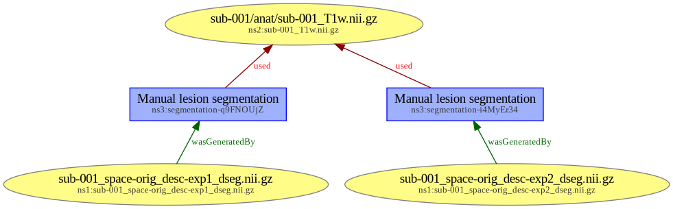
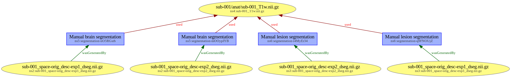

# Provenance of manual segmentations

## Goal

This example aims at showing provenance metadata for a study dataset in which several experts performed different types of manual segmentations from the same T1w file.

* dataset `raw` contains the input T1w file;
* derived dataset `seg-brain` contains manual brain segmentations;
* derived dataset `seg-lesions` contains manual segmentations of lesions.

## Directory tree

> [!NOTE]
> Note that the `docs/` directories contains explanatory data (see [Provenance as a RDF graph](#provenance-as-a-rdf-graph)) that is not required to encode provenance.

```
.
├── dataset_description.json
├── derivatives
│   ├── seg-brain
│   │   ├── dataset_description.json
│   │   ├── descriptions.tsv
│   │   ├── docs
│   │   │   ├── prov-seg.jsonld
│   │   │   └── prov-seg.png
│   │   ├── prov
│   │   │   ├── provenance.tsv
│   │   │   ├── prov-seg_act.json
│   │   │   └── prov-seg_ent.json
│   │   └── sub-001
│   │       └── anat
│   │           ├── sub-001_space-orig_desc-exp1_dseg.json
│   │           ├── sub-001_space-orig_desc-exp1_dseg.nii.gz
│   │           ├── sub-001_space-orig_desc-exp2_dseg.json
│   │           └── sub-001_space-orig_desc-exp2_dseg.nii.gz
│   └── seg-lesions
│       ├── dataset_description.json
│       ├── descriptions.tsv
│       ├── docs
│       │   ├── prov-seg.jsonld
│       │   └── prov-seg.png
│       ├── prov
│       │   ├── provenance.tsv
│       │   ├── prov-seg_act.json
│       │   └── prov-seg_ent.json
│       └── sub-001
│           └── anat
│               ├── sub-001_space-orig_desc-exp1_dseg.json
│               ├── sub-001_space-orig_desc-exp1_dseg.nii.gz
│               ├── sub-001_space-orig_desc-exp2_dseg.json
│               └── sub-001_space-orig_desc-exp2_dseg.nii.gz
├── docs
│   ├── prov-study.jsonld
│   └── prov-study.png
├── README.md
└── sourcedata
    └── raw
        ├── dataset_description.json
        └── sub-001
            └── anat
                ├── sub-001_T1w.json
                └── sub-001_T1w.nii.gz
```

## Provenance as a RDF graph

For each derived dataset, provenance metadata can be aggregated as JSON-LD RDF graphs, which are available inside the `docs` directory:
* [`derivatives/seg-brain/docs/prov-seg.jsonld`](derivatives/seg-brain/docs/prov-seg.jsonld)
* [`derivatives/seg-lesions/docs/prov-lesions.jsonld`](derivatives/seg-lesions/docs/prov-seg.jsonld)

These two graphs can be be merged into a study-level provenance graph available here:
* [`docs/prov-study.jsonld`](docs/prov-study.jsonld)

Here are the rendered versions of the three graphs, also available in each `docs` directory.
* [`derivatives/seg-brain/docs/prov-seg.png`](derivatives/seg-brain/docs/prov-seg.png).

* [`derivatives/seg-lesions/docs/prov-lesions.png`](derivatives/seg-lesions/docs/prov-seg.png).

* [`docs/prov-seg.png`](docs/prov-study.png).

