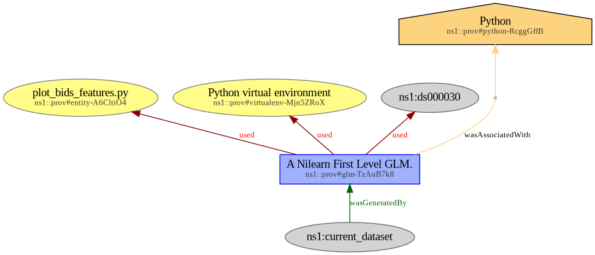

# Provenance of fMRI first-level analysis with Nilearn

This BIDS example shows provenance metadata for [Nilearn's](https://nilearn.github.io/) example ["First level analysis of a complete BIDS dataset from openneuro"](https://nilearn.github.io/0.12.0/auto_examples/04_glm_first_level/plot_bids_features.html).

> [!WARNING]
> We don't know right now how to deal with the "NOT_INCLUDED" error that occurs on files
> generated by Nilearn. For now we focus on validating the (non sidecar) provenance metadata only.
> As a result, validation of the `sub-10159` directory is ignored through a `.bidsignore` file.

In version 0.12.0, Nilearn provides the following provenance metadata inside the `dataset_description.json` generated by this example.

```JSON
"GeneratedBy": [
  {
    "CodeURL": "https://github.com/nilearn/nilearn/releases/tag/0.12.0",
    "Description": "A Nilearn First Level Model-level GLM.",
    "Name": "nilearn",
    "Version": "0.12.0"
  }
```

## Original dataset

This is a derivative dataset, based upon `sub-10159` data from OpenfMRI DS000030 (cf. https://openneuro.org/datasets/ds000030/).

## Code

The code that generated this dataset is the ["First level analysis of a complete BIDS dataset from openneuro"](https://nilearn.github.io/0.12.0/auto_examples/04_glm_first_level/plot_bids_features.html) example from Nilearn version 0.12.0.
The corresponding python script is available on [Nilearn's github project](https://github.com/nilearn/nilearn/blob/0.12.0/examples/04_glm_first_level/plot_bids_features.py).

## Directory tree

The directory tree is as follows. Files marked with a ✍️ were generated manually, other files were generated by the analysis step.
Generated files other than .json were emptied.

> [!NOTE]
> Note that the `docs/` directory contains explanatory data (see [Provenance as a RDF graph](#provenance-as-a-rdf-graph)) that is not required to encode provenance.

```
.
├── ✍️ dataset_description.json
├── ✍️ docs
│   ├── ✍️ prov-nilearn.jsonld
│   └── ✍️ prov-nilearn.png
├── ✍️ prov
│   ├── ✍️ prov-nilearn_act.json
│   ├── ✍️ prov-nilearn_ent.json
│   ├── ✍️ prov-nilearn_env.json
│   └── ✍️ prov-nilearn_soft.json
├── ✍️ README.md
└── sub-10159
    ├── report.html
    ├── statmap.json
    ├── sub-10159_task-stopsignal_space-MNI152NLin2009cAsym_contrast-stopsuccessMinusGo_clusters.json
    ├── sub-10159_task-stopsignal_space-MNI152NLin2009cAsym_contrast-stopsuccessMinusGo_clusters.tsv
    ├── sub-10159_task-stopsignal_space-MNI152NLin2009cAsym_contrast-stopsuccessMinusGo_design.png
    ├── sub-10159_task-stopsignal_space-MNI152NLin2009cAsym_contrast-stopsuccessMinusGo_stat-effect_statmap.nii.gz
    ├── sub-10159_task-stopsignal_space-MNI152NLin2009cAsym_contrast-stopsuccessMinusGo_stat-p_statmap.nii.gz
    ├── sub-10159_task-stopsignal_space-MNI152NLin2009cAsym_contrast-stopsuccessMinusGo_stat-t_statmap.nii.gz
    ├── sub-10159_task-stopsignal_space-MNI152NLin2009cAsym_contrast-stopsuccessMinusGo_stat-variance_statmap.nii.gz
    ├── sub-10159_task-stopsignal_space-MNI152NLin2009cAsym_contrast-stopsuccessMinusGo_stat-z_statmap.nii.gz
    ├── sub-10159_task-stopsignal_space-MNI152NLin2009cAsym_corrdesign.png
    ├── sub-10159_task-stopsignal_space-MNI152NLin2009cAsym_design.json
    ├── sub-10159_task-stopsignal_space-MNI152NLin2009cAsym_design.png
    ├── sub-10159_task-stopsignal_space-MNI152NLin2009cAsym_design.tsv
    ├── sub-10159_task-stopsignal_space-MNI152NLin2009cAsym_mask.nii.gz
    ├── sub-10159_task-stopsignal_space-MNI152NLin2009cAsym_stat-errorts_statmap.nii.gz
    └── sub-10159_task-stopsignal_space-MNI152NLin2009cAsym_stat-rsquared_statmap.nii.gz
```

## Provenance as a RDF graph

Provenance metadata can be aggregated as a JSON-LD RDF graph, which is available in [`docs/prov-nilearn.jsonld`](docs/prov-nilearn.jsonld). This is a rendered version of the graph, also available in docs/prov-nilearn.png.


