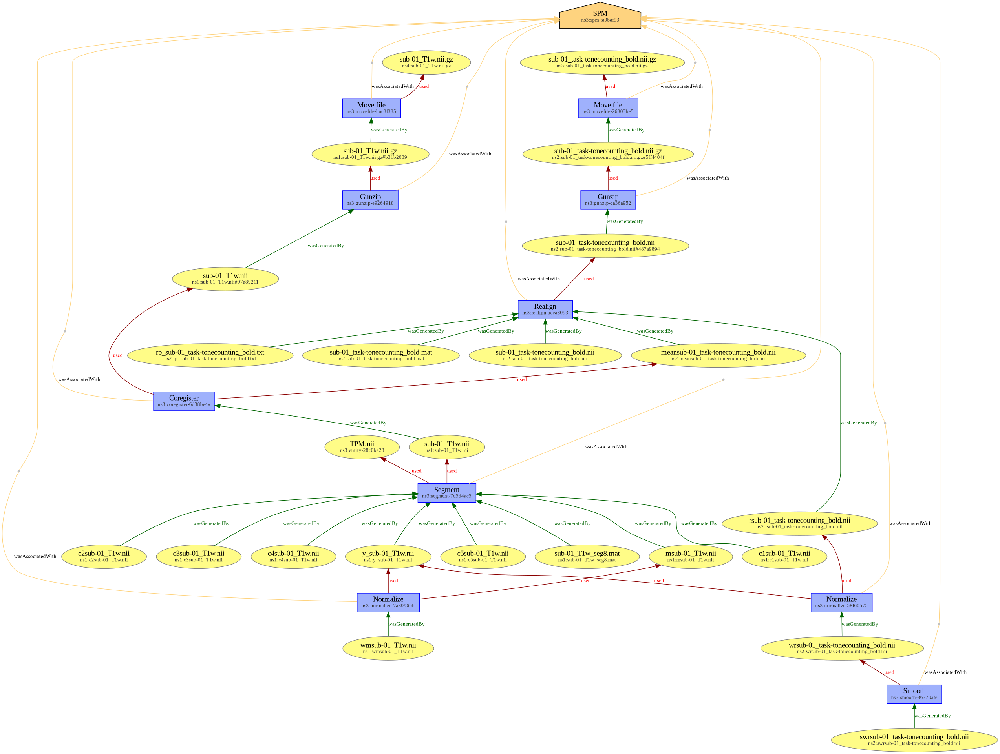

# Provenance of fMRI preprocessing with SPM

This example aims at showing provenance metadata for a functional MRI preprocessing performed with [`SPM`](https://www.fil.ion.ucl.ac.uk/spm/). Provenance metadata was created manually ; it acts as a guideline for further machine-generated provenance by `SPM`. 

## Original dataset

This is a derivative dataset, based upon `sub-01` data from OpenfMRI DS000011 classification learning and tone counting experiment (cf. https://openfmri.org/dataset/ds000011/).

## Code

The Matlab batch file `code/spm_preprocessing.m` allows to perform the preprocessing.

## Directory tree

The directory tree is as follows. Files marked with a ✍️ were generated manually.

```
.
├── ✍️ code
│   ├── ✍️ merge_prov.py
│   └── ✍️ spm_preprocessing.m
├── ✍️ dataset_description.json
├── ✍️ prov
│   ├── ✍️ prov-spm_act.json
│   ├── ✍️ prov-spm_ent.json
│   └── ✍️ prov-spm_soft.json
├── README.md
└── sub-01
    ├── anat
    │   ├── c1sub-01_T1w.nii
    │   ├── c2sub-01_T1w.nii
    │   ├── c3sub-01_T1w.nii
    │   ├── c4sub-01_T1w.nii
    │   ├── c5sub-01_T1w.nii
    │   ├── msub-01_T1w.nii
    │   ├── sub-01_T1w.nii
    │   ├── sub-01_T1w.nii.gz
    │   ├── sub-01_T1w_seg8.mat
    │   ├── wmsub-01_T1w.nii
    │   └── y_sub-01_T1w.nii
    └── func
        ├── meansub-01_task-tonecounting_bold.nii
        ├── rp_sub-01_task-tonecounting_bold.txt
        ├── sub-01_task-tonecounting_bold.mat
        ├── sub-01_task-tonecounting_bold.nii
        ├── sub-01_task-tonecounting_bold.nii.gz
        ├── swsub-01_task-tonecounting_bold.nii
        └── wsub-01_task-tonecounting_bold.nii
```

## Provenance as a RDF graph

Provenance metadata can be aggregated as a JSON-LD RDF graph, which is available in [`docs/prov-spm.jsonld`](docs/prov-spm.jsonld). This is a rendered version of the graph, also available in docs/prov-spm.png.


