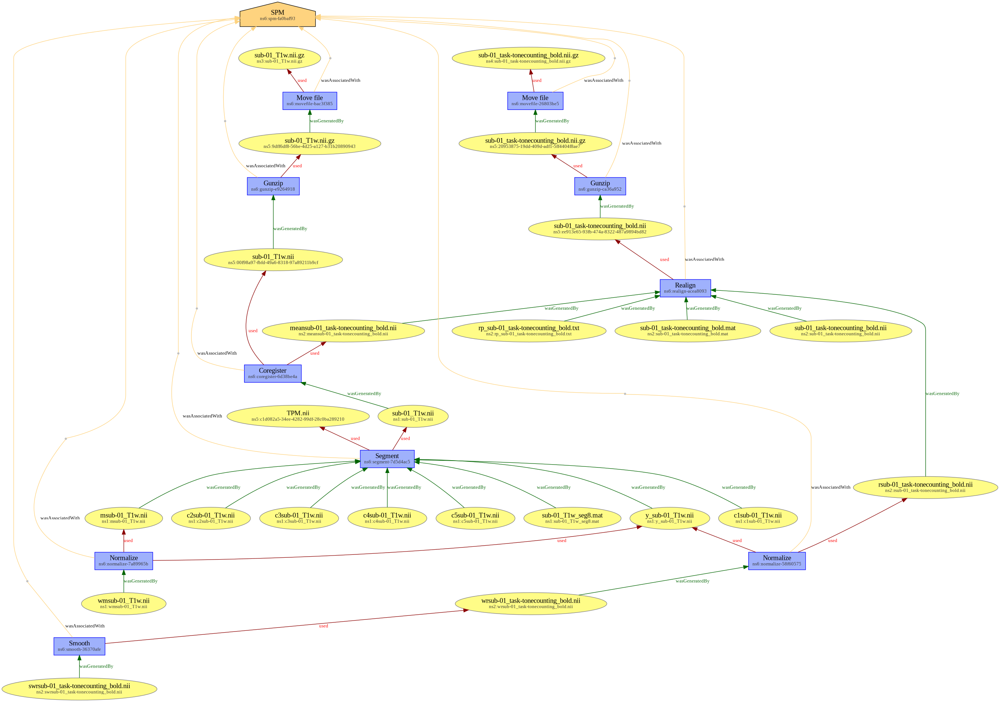

# Provenance of fMRI preprocessing with SPM

This example aims at showing provenance metadata for a functional MRI preprocessing performed with [`SPM`](https://www.fil.ion.ucl.ac.uk/spm/). Provenance metadata was created manually ; it acts as a guideline for further machine-generated provenance by `SPM`. 

> [!WARNING]
> We don't know right now how to deal with the "NOT_INCLUDED" error that occurs on files
> generated by SPM (and their sidecars). For now we focus on validating the (non sidecar) provenance metadata only.
> As a result, validation of the `sub-01/` directory is ignored through a `.bidsignore` file.

## Original dataset

This is a derivative dataset, based upon `sub-01` data from OpenfMRI DS000011 classification learning and tone counting experiment (cf. https://openfmri.org/dataset/ds000011/).

## Code

The Matlab batch file `code/spm_preprocessing.m` allows to perform the preprocessing.

## Directory tree

The directory tree is as follows. Files marked with a ✍️ were generated manually, other files were generated by the preprocessing step.

> [!NOTE]
> Note that the `docs/` directory contains explanatory data (see [Provenance as a RDF graph](#provenance-as-a-rdf-graph)) that is not required to encode provenance.

```
.
├── ✍️ code
│   └── ✍️ spm_preprocessing.m
├── ✍️ dataset_description.json
├── ✍️ docs
│   ├── ✍️ prov-spm.jsonld
│   └── ✍️ prov-spm.png
├── ✍️ prov
│   ├── ✍️ prov-spm_act.json
│   ├── ✍️ prov-spm_ent.json
│   └── ✍️ prov-spm_soft.json
├── ✍️ README.md
└── sub-01
    ├── anat
    │   ├── ✍️ c1sub-01_T1w.json
    │   ├── c1sub-01_T1w.nii
    │   ├── ✍️ c2sub-01_T1w.json
    │   ├── c2sub-01_T1w.nii
    │   ├── ✍️ c3sub-01_T1w.json
    │   ├── c3sub-01_T1w.nii
    │   ├── ✍️ c4sub-01_T1w.json
    │   ├── c4sub-01_T1w.nii
    │   ├── ✍️ c5sub-01_T1w.json
    │   ├── c5sub-01_T1w.nii
    │   ├── ✍️ msub-01_T1w.json
    │   ├── msub-01_T1w.nii
    │   ├── ✍️ sub-01_T1w.json
    │   ├── sub-01_T1w.nii
    │   ├── ✍️ sub-01_T1w_seg8.json
    │   ├── sub-01_T1w_seg8.mat
    │   ├── ✍️ wmsub-01_T1w.json
    │   ├── wmsub-01_T1w.nii
    │   ├── ✍️ y_sub-01_T1w.json
    │   └── y_sub-01_T1w.nii
    └── func
        ├── ✍️ meansub-01_task-tonecounting_bold.json
        ├── meansub-01_task-tonecounting_bold.nii
        ├── ✍️ rp_sub-01_task-tonecounting_bold.json
        ├── rp_sub-01_task-tonecounting_bold.txt
        ├── ✍️ rsub-01_task-tonecounting_bold.json
        ├── rsub-01_task-tonecounting_bold.nii
        ├── sub-01_task-tonecounting_bold.mat
        ├── sub-01_task-tonecounting_bold.nii
        ├── ✍️ swrsub-01_task-tonecounting_bold.json
        ├── swrsub-01_task-tonecounting_bold.nii
        ├── ✍️ wrsub-01_task-tonecounting_bold.json
        └── wrsub-01_task-tonecounting_bold.nii
```

## Provenance as a RDF graph

Provenance metadata can be aggregated as a JSON-LD RDF graph, which is available in [`docs/prov-spm.jsonld`](docs/prov-spm.jsonld). This is a rendered version of the graph, also available in docs/prov-spm.png.



## Description of processes or pipelines

Provenance can also be described by providing `GeneratedBy` with an array of objects representing pipelines or processes that generated the dataset.

In this case, the `GeneratedBy` field of the `dataset_description.json` file would have contain:

```JSON
{
    ...
    "GeneratedBy": [
        {
          "Name": "SPM preprocessing",
          "Version": "SPM12r7771",
          "Description": "Preprocessing of anatomical and functional MRI data with SPM",
          "CodeURL": "bids::code/spm_preprocessing.m"
        }
    ]
}
```
